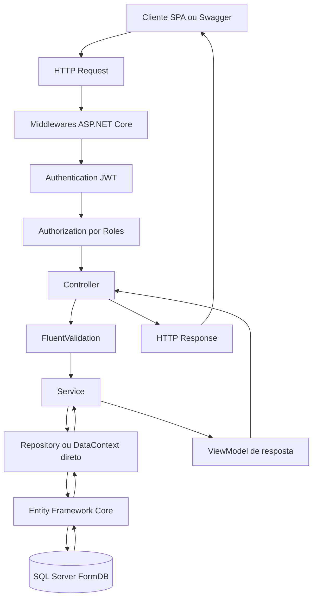
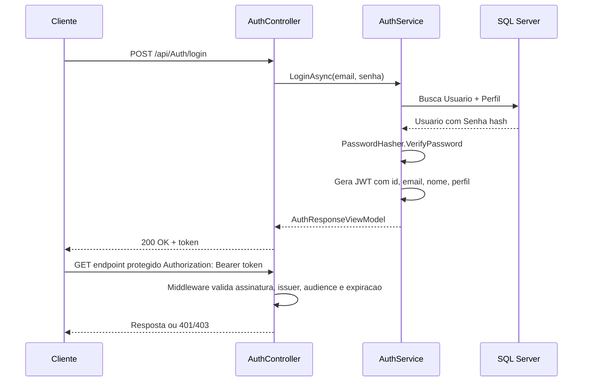
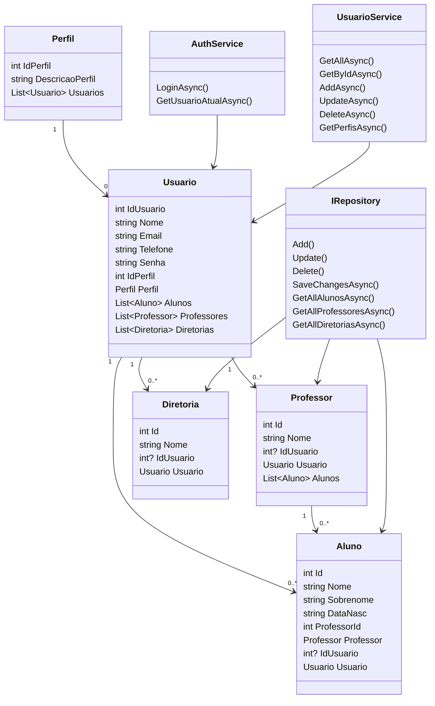
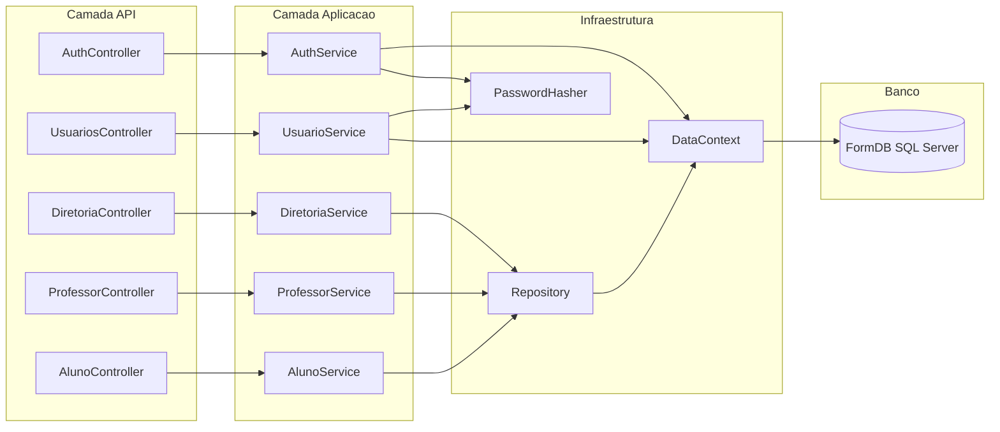
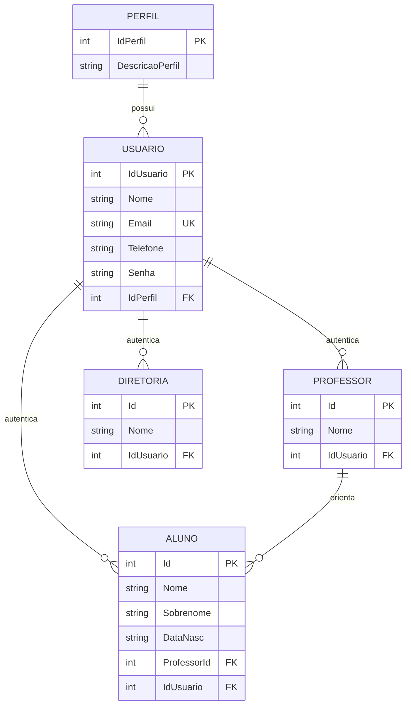

# Documentacao tecnica do Backend API

## Visao geral

O backend `form_API` e uma API REST em ASP.NET Core 10 para gerenciamento escolar. Ele expoe operacoes para alunos, professores, diretoria, usuarios, perfis e autenticacao JWT.

O projeto usa:

- ASP.NET Core Web API para controllers HTTP.
- Entity Framework Core para persistencia.
- SQL Server como banco principal em container.
- FluentValidation para validacao de entradas.
- JWT Bearer para autenticacao e autorizacao por perfil.
- Swagger/OpenAPI para documentacao interativa.
- xUnit e Moq para testes unitarios.

## Padrao arquitetural

O padrao principal e uma arquitetura em camadas, com API Controllers, Services, Repository/DataContext e Models. O projeto tambem usa DTOs/ViewModels para separar contratos HTTP das entidades de banco.

Responsabilidades por camada:

- `Controllers`: recebem requisicoes HTTP, aplicam rotas, autorizacao e codigos de resposta.
- `Validators`: validam DTOs antes da execucao dos controllers via FluentValidation.
- `Services`: concentram regras de aplicacao, orquestram repositorios e montam ViewModels.
- `Repository`: encapsula consultas de `Aluno`, `Professor` e `Diretoria`.
- `DataContext`: configura o modelo EF Core, relacionamentos, indices, seeds e migrations.
- `Models`: representam as entidades persistidas.
- `ViewModels`: representam payloads de entrada e saida da API.
- `Security`: possui utilitarios de seguranca, como hash e verificacao de senha.
- `Swagger`: possui filtros de documentacao OpenAPI, incluindo seguranca JWT por endpoint.

## Comunicacao entre camadas



Observacoes:

- `AuthService` e `UsuarioService` usam `DataContext` diretamente por trabalharem com seguranca, perfis e operacoes especificas de usuario.
- `AlunoService`, `ProfessorService` e `DiretoriaService` usam `IRepository`.
- `Program.cs` registra services, repository, validators, JWT, Swagger e EF Core.

## Fluxo de autenticacao JWT



Perfis usados em autorizacao:

- `Administrador`: acesso administrativo total.
- `Contribuinte`: pode criar e atualizar alunos, professores e diretoria.
- `Leitor`: pode acessar endpoints de leitura autenticados.

## Diagrama de classes



## Diagrama de comunicacao entre camadas



## Modelo entidade-relacional



Cardinalidades e regras:

- `Perfil` 1:N `Usuario`.
- `Usuario` 1:N `Aluno`, `Professor` e `Diretoria`.
- `Professor` 1:N `Aluno`.
- `Usuario.Email` e unico.
- Ao excluir `Usuario`, as FKs opcionais em `Aluno`, `Professor` e `Diretoria` sao definidas como `NULL`.
- Ao excluir `Professor`, os `Alunos` vinculados seguem a configuracao de cascade da relacao `ProfessorId`.

## Entidades e tabelas

### Perfil

Tabela de dominio para autorizacao.

Campos:

- `IdPerfil`: chave primaria.
- `DescricaoPerfil`: nome do perfil.

Seeds:

- `Administrador`
- `Contribuinte`
- `Leitor`

### Usuario

Tabela de usuarios autenticaveis.

Campos:

- `IdUsuario`: chave primaria.
- `Nome`: nome do usuario.
- `Email`: email de login, unico.
- `Telefone`: telefone de contato.
- `Senha`: hash PBKDF2-SHA256.
- `IdPerfil`: FK para `Perfil`.

Seed inicial:

- `admin@escola.com`
- senha inicial: `Senha@123`
- perfil: `Administrador`

Tambem existem usuarios seedados para professores e alunos.

### Professor

Tabela de professores.

Campos:

- `Id`: chave primaria.
- `Nome`: nome do professor.
- `IdUsuario`: FK opcional para `Usuario`.

### Aluno

Tabela de alunos.

Campos:

- `Id`: chave primaria.
- `Nome`: nome.
- `Sobrenome`: sobrenome.
- `DataNasc`: data em texto no formato `dd/MM/yyyy`.
- `ProfessorId`: FK obrigatoria para `Professor`.
- `IdUsuario`: FK opcional para `Usuario`.

### Diretoria

Tabela de administracao escolar.

Campos:

- `Id`: chave primaria.
- `Nome`: nome do integrante da diretoria.
- `IdUsuario`: FK opcional para `Usuario`.

## Migrations

As migrations ficam em `Backend_API/Migrations` e sao aplicadas automaticamente no startup da API por `db.Database.Migrate()`.

### 20260521160031_InitialSqlServer

Cria as tabelas iniciais:

- `Professores`
- `Alunos`

Tambem cria a FK `Alunos.ProfessorId -> Professores.Id` e insere os registros iniciais.

### 20260521194537_SeedFiftyRecords

Complementa a base de exemplo com 50 professores e 50 alunos.

### 20260521202457_AddJwtAuthUsuariosDiretoria

Adiciona a camada de autenticacao/autorizacao no banco:

- Cria `Perfil`.
- Cria `Usuario`.
- Cria `Diretoria`.
- Adiciona `IdUsuario` em `Alunos`.
- Adiciona `IdUsuario` em `Professores`.
- Cria indices das FKs.
- Cria indice unico em `Usuario.Email`.
- Insere 3 perfis.
- Insere 20 usuarios.
- Vincula parte dos alunos e professores aos usuarios seedados.

## Swagger/OpenAPI

Swagger e configurado em `Program.cs`.

Recursos documentados:

- Titulo, versao e descricao da API.
- Comentarios XML de controllers e DTOs.
- Esquema de seguranca `Bearer`.
- Filtro `AuthorizeOperationFilter`, que marca endpoints protegidos com seguranca JWT e adiciona respostas `401` e `403`.

Uso no Swagger UI:

1. Abrir `/swagger` no ambiente de desenvolvimento.
2. Chamar `POST /api/Auth/login`.
3. Copiar o token retornado.
4. Clicar em `Authorize`.
5. Informar `Bearer {token}`.
6. Executar os endpoints protegidos.

## Autenticacao e autorizacao

Configuracao JWT:

- `Jwt:Key`: chave simetrica usada para assinar tokens.
- `Jwt:Issuer`: emissor esperado.
- `Jwt:Audience`: audiencia esperada.
- `Jwt:ExpirationMinutes`: tempo de expiracao.

Claims emitidas:

- `sub`: `IdUsuario`.
- `email`: email.
- `nameidentifier`: `IdUsuario`.
- `name`: nome.
- `id_perfil`: identificador do perfil.
- `role`: descricao do perfil.

Politicas e roles:

- `Administrador`: acesso administrativo.
- `Contribuinte`: inclui administrador e contribuinte.
- `Leitor`: inclui administrador, contribuinte e leitor.

## FluentValidation

Os validators ficam em `Backend_API/Validators` e sao registrados por `AddValidatorsFromAssemblyContaining<AlunoCreateEditViewModelValidator>()`.

Validators existentes:

- `AlunoCreateEditViewModelValidator`
- `ProfessorCreateEditViewModelValidator`
- `DiretoriaCreateEditViewModelValidator`
- `LoginRequestViewModelValidator`
- `UsuarioCreateViewModelValidator`

Regras principais:

- Campos obrigatorios para nomes, email, telefone e senha.
- Tamanho maximo para nomes e email.
- Data de nascimento de aluno no formato `dd/MM/yyyy`.
- `ProfessorId`, `IdUsuario` e `IdPerfil` devem ser positivos quando informados.
- Email deve ter formato valido.
- Senha de usuario deve ter no minimo 8 caracteres.

## Testes unitarios

Os testes ficam em `Backend_API/form_API.Tests`.

Ferramentas:

- xUnit
- Moq
- FluentValidation.TestHelper
- SQLite em memoria para testes de `UsuarioService`

Cobertura atual:

- `AlunoControllerTests`: valida listagem e criacao de aluno.
- `UsuariosControllerTests`: valida criacao de usuario.
- `AlunoServiceTests`: valida mapeamento e criacao de aluno.
- `UsuarioServiceTests`: valida hash de senha e duplicidade de email.
- `AlunoCreateEditViewModelValidatorTests`: valida regras de aluno.
- `ProfessorCreateEditViewModelValidatorTests`: valida regras de professor.
- `UsuarioCreateViewModelValidatorTests`: valida regras de usuario.

Comando:

```bash
cd Backend_API
dotnet test form_API.Tests/form_API.Tests.csproj
```

## CRUD e endpoints

### Auth

| Metodo | Rota | Autorizacao | Descricao |
| --- | --- | --- | --- |
| POST | `/api/Auth/login` | Publico | Autentica usuario e retorna JWT |
| GET | `/api/Auth/me` | Autenticado | Retorna usuario atual |
| GET | `/api/Auth/autorizar` | Autenticado | Verifica se o token e valido |
| GET | `/api/Auth/autorizar/admin` | Administrador | Verifica acesso administrativo |

### Aluno

| Metodo | Rota | Autorizacao | Descricao |
| --- | --- | --- | --- |
| GET | `/api/Aluno` | Autenticado | Lista alunos com professor e usuario |
| GET | `/api/Aluno/{AlunoId}` | Autenticado | Busca aluno por id |
| GET | `/api/Aluno/ByProfessor/{ProfessorId}` | Autenticado | Lista alunos por professor |
| POST | `/api/Aluno` | Administrador, Contribuinte | Cria aluno |
| PUT | `/api/Aluno/{AlunoId}` | Administrador, Contribuinte | Atualiza aluno |
| DELETE | `/api/Aluno/{AlunoId}` | Administrador | Exclui aluno |

Payload de criacao/atualizacao:

```json
{
  "nome": "Maria",
  "sobrenome": "Solano",
  "dataNasc": "25/02/1982",
  "professorId": 1,
  "idUsuario": 12
}
```

### Professor

| Metodo | Rota | Autorizacao | Descricao |
| --- | --- | --- | --- |
| GET | `/api/Professor` | Autenticado | Lista professores com alunos e usuario |
| GET | `/api/Professor/{ProfessorId}` | Autenticado | Busca professor por id |
| POST | `/api/Professor` | Administrador, Contribuinte | Cria professor |
| PUT | `/api/Professor/{ProfessorId}` | Administrador, Contribuinte | Atualiza professor |
| DELETE | `/api/Professor/{ProfessorId}` | Administrador | Exclui professor |

Payload de criacao/atualizacao:

```json
{
  "nome": "Vinicius",
  "idUsuario": 2
}
```

### Diretoria

| Metodo | Rota | Autorizacao | Descricao |
| --- | --- | --- | --- |
| GET | `/api/Diretoria` | Autenticado | Lista integrantes da diretoria |
| GET | `/api/Diretoria/{DiretoriaId}` | Autenticado | Busca integrante por id |
| POST | `/api/Diretoria` | Administrador, Contribuinte | Cria integrante |
| PUT | `/api/Diretoria/{DiretoriaId}` | Administrador, Contribuinte | Atualiza integrante |
| DELETE | `/api/Diretoria/{DiretoriaId}` | Administrador | Exclui integrante |

Payload de criacao/atualizacao:

```json
{
  "nome": "Administrador Sistema",
  "idUsuario": 1
}
```

### Usuarios

| Metodo | Rota | Autorizacao | Descricao |
| --- | --- | --- | --- |
| GET | `/api/usuarios` | Administrador, Contribuinte | Lista usuarios |
| GET | `/api/usuarios/{usuarioId}` | Administrador, Contribuinte | Busca usuario por id |
| GET | `/api/usuarios/perfis` | Administrador | Lista perfis disponiveis |
| POST | `/api/usuarios` | Administrador | Cria usuario |
| PUT | `/api/usuarios/{usuarioId}` | Administrador | Atualiza usuario |
| DELETE | `/api/usuarios/{usuarioId}` | Administrador | Exclui usuario |

Payload de criacao/atualizacao:

```json
{
  "nome": "Usuario Novo",
  "email": "novo@escola.com",
  "telefone": "11999990000",
  "senha": "Senha@123",
  "idPerfil": 2
}
```

## Tratamento de erros

Padroes usados:

- `200 OK`: consulta ou exclusao concluida.
- `201 Created`: criacao ou atualizacao concluida.
- `400 Bad Request`: validacao ou regra de negocio falhou.
- `401 Unauthorized`: token ausente, invalido ou expirado.
- `403 Forbidden`: token valido sem perfil suficiente.
- `404 Not Found`: registro nao encontrado.
- `500 Internal Server Error`: falha inesperada de banco ou aplicacao.

## Execucao local

Backend:

```bash
cd Backend_API
dotnet restore
dotnet run
```

Banco em container usado no ambiente atual:

```bash
docker run -d --name form_api_db --network form_api_net --network-alias db -p 14333:1433 \
  -e ACCEPT_EULA=Y \
  -e SA_PASSWORD=Your_password123 \
  -e MSSQL_PID=Express \
  mcr.microsoft.com/mssql/server:2022-latest
```

Aplicar migrations manualmente contra o container:

```bash
cd Backend_API
ConnectionStrings__DefaultConnection="Server=localhost,14333;Database=FormDB;User Id=sa;Password=Your_password123;TrustServerCertificate=True;Encrypt=False" dotnet ef database update
```

API em container:

```bash
docker build -t form-api:local Backend_API
docker run -d --name form_api_app --network form_api_net -p 8080:80 \
  -e ASPNETCORE_ENVIRONMENT=Development \
  -e ConnectionStrings__DefaultConnection="Server=db,1433;Database=FormDB;User Id=sa;Password=Your_password123;TrustServerCertificate=True;Encrypt=False" \
  form-api:local
```

## Pontos de evolucao

- Separar `UsuarioCreateViewModel` de `UsuarioUpdateViewModel` para permitir update sem troca obrigatoria de senha.
- Adicionar testes para `AuthService`, `DiretoriaService`, `ProfessorService` e autorizacao.
- Criar controllers especificos de `Perfil` se a tabela deixar de ser apenas dominio fixo.
- Mover segredos JWT e senha do banco para variaveis de ambiente em todos os ambientes.
